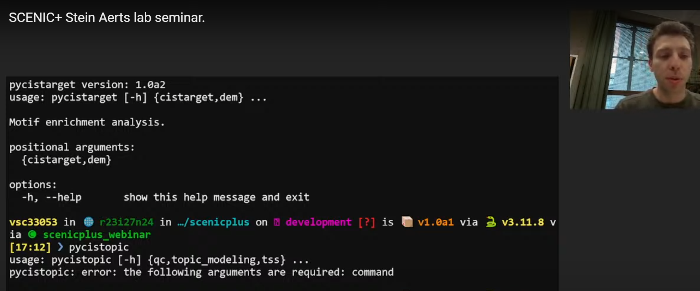
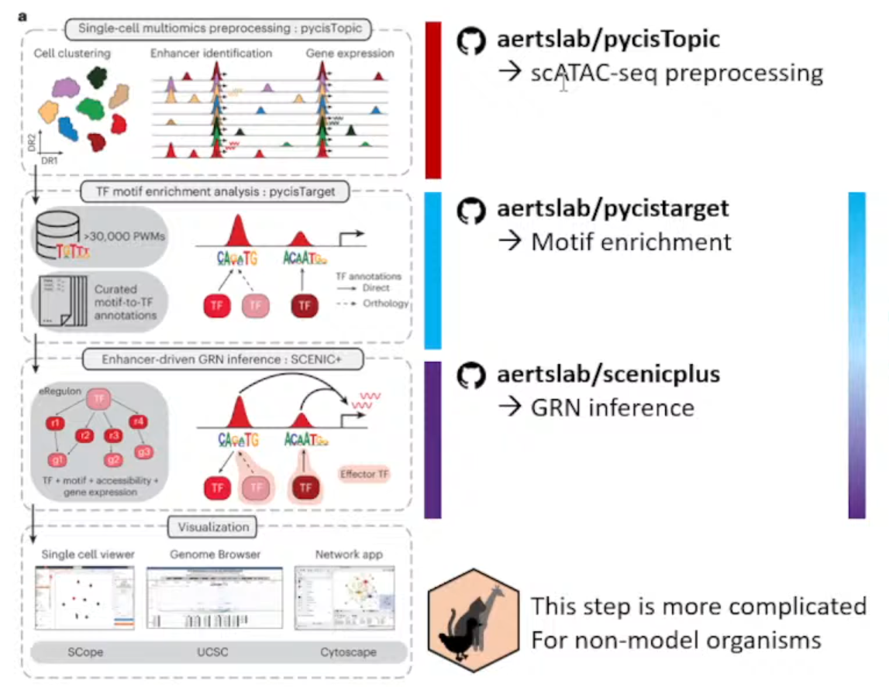
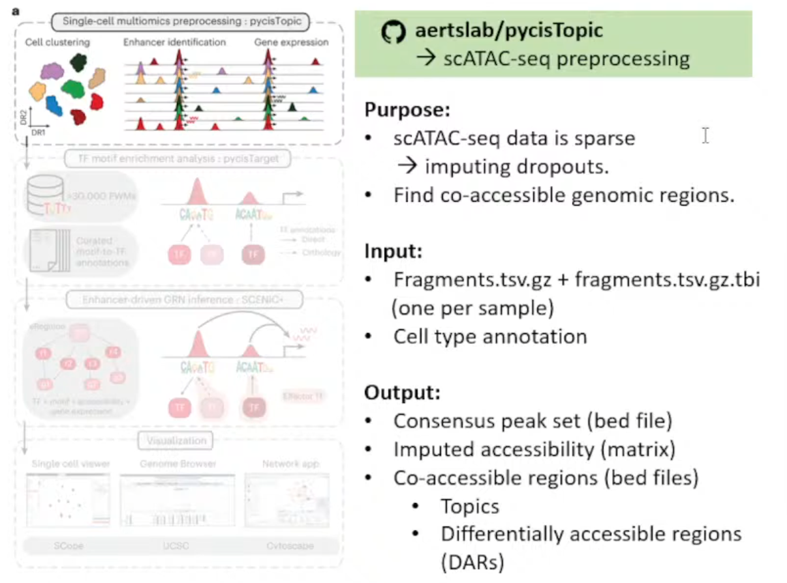
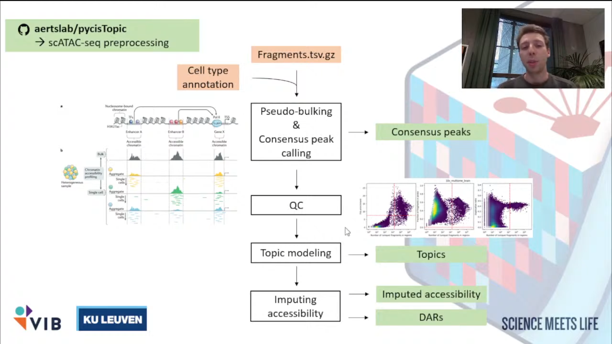
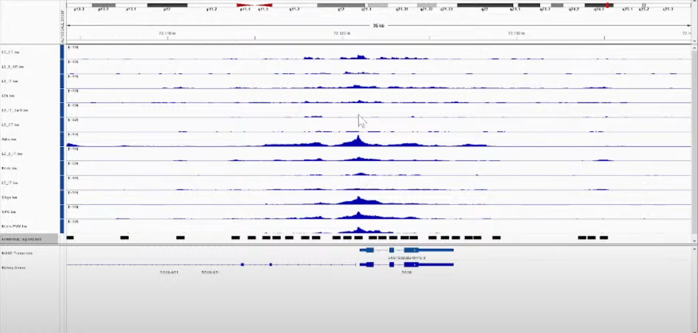
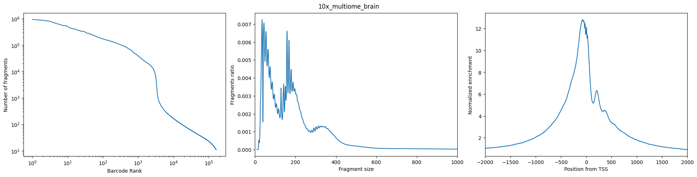
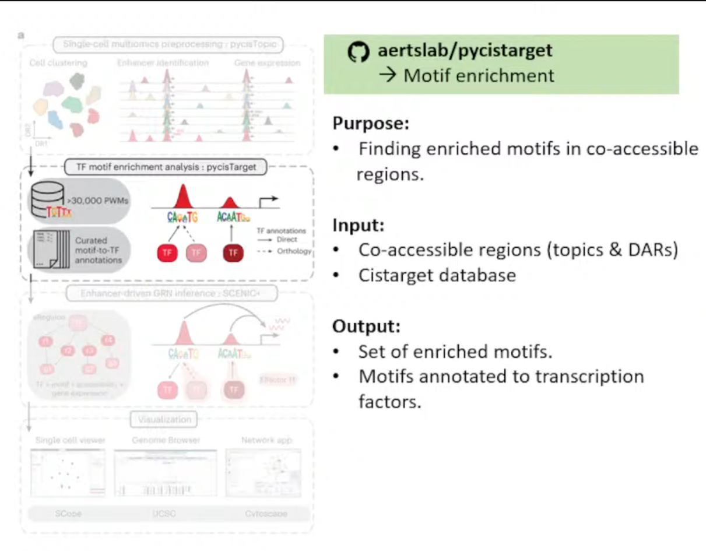
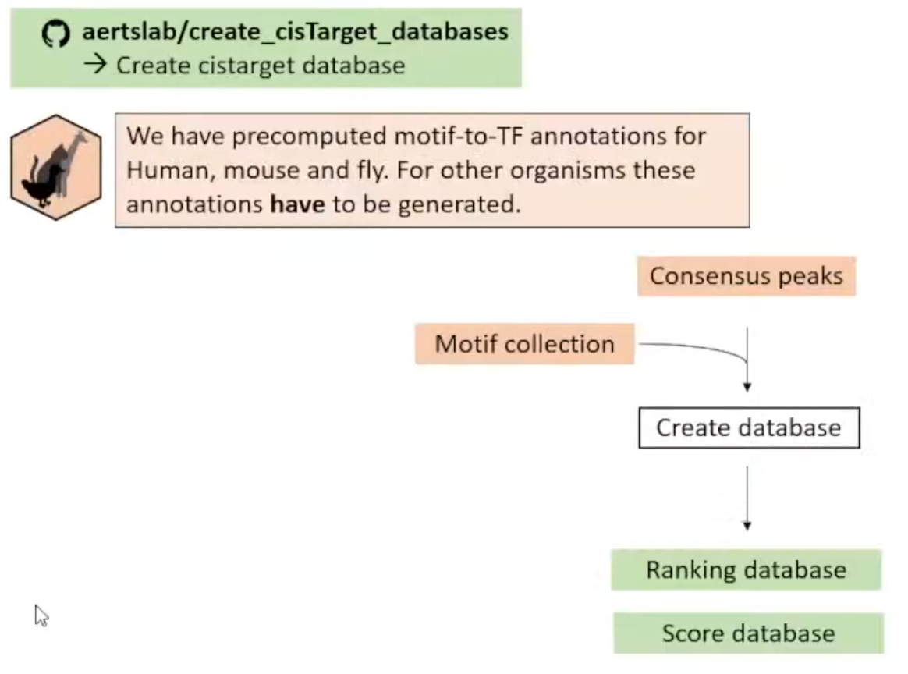
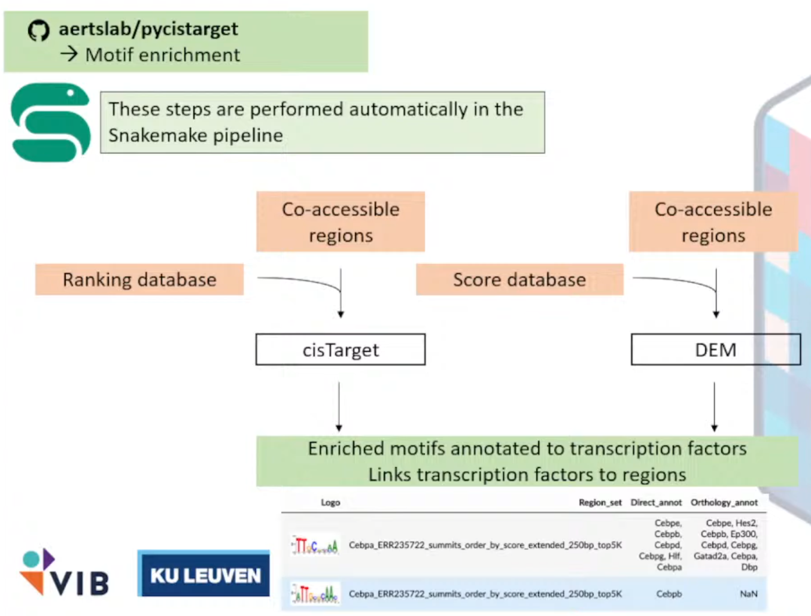
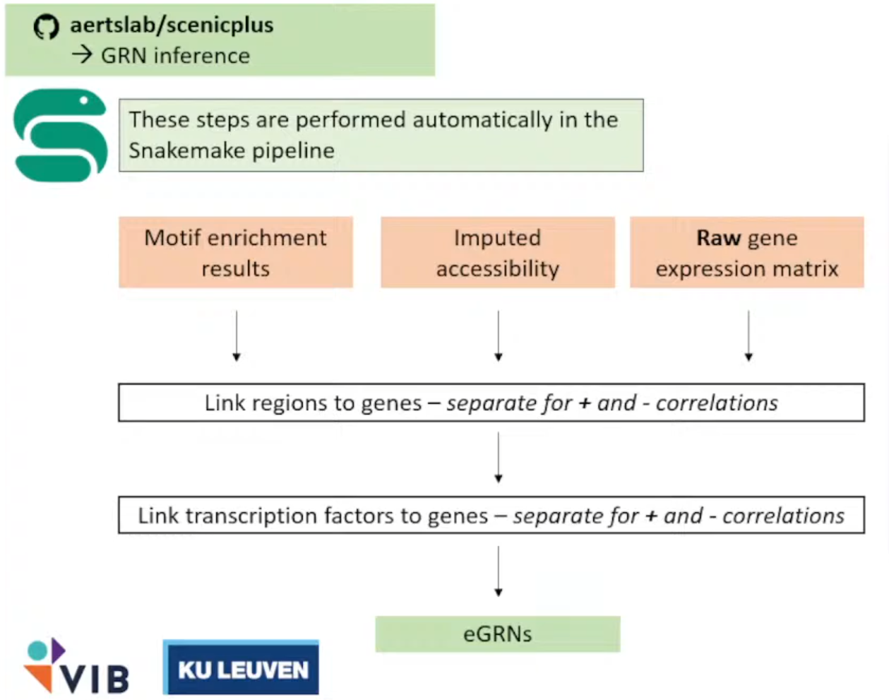

链接指路:[SCENIC+ Stein Aerts lab seminar.](https://www.youtube.com/watch?v=QW63LLd1XC8&t=2079s)

讲解者：Seppe De Winter，文章的二作，来自巨无霸的[Stein Aerts Lab - VIB - KULeuven](https://aertslab.org/)组

## 安装 Install

这部分真的不想多说，因为众所周知的原因，安装得需要借助强大的“外”力；以及因为“pybigwig==0.3.23”的原因，Windows系统我试了很多次都没有成功。

```
git clone https://github.com/aertslab/scenicplus
#直播的时候这一步能秒完成，真的馋哭了
#git clone git@github.com:aertslab/scenicplus.git
mamba create --name scenicplus python=3.11.8
#推荐3.11版本
mamba activate scenicplus
cd scenicplus/
git checkout development
pip install .
```

Notes:如果出现下面的报错，原因是git连不上（典）

```shell
fatal: unable to access 'https://github.com/aertslab/LoomXpy/': Recv failure: Connection was reset
  error: subprocess-exited-with-error

  × git clone --filter=blob:none --quiet https://github.com/aertslab/LoomXpy 'C:\Users\Hanoi\AppData\Local\Temp\pip-install-vyuu71m4\loomxpy_152eb1f7ca014b02893fa317b79a7d6c' did not run successfully.
  │ exit code: 128
  ╰─> See above for output.

  note: This error originates from a subprocess, and is likely not a problem with pip.
error: subprocess-exited-with-error

× git clone --filter=blob:none --quiet https://github.com/aertslab/LoomXpy 'C:\Users\Hanoi\AppData\Local\Temp\pip-install-vyuu71m4\loomxpy_152eb1f7ca014b02893fa317b79a7d6c' did not run successfully.
│ exit code: 128
╰─> See above for output.

note: This error originates from a subprocess, and is likely not a problem with pip.
```

这个时候我的解决办法是换成美国的VPN(暂时)

有一个十分费力的安装方法，后面得单独开一个页面来讲述了:astonished:

### 验证安装成功:

终端中直接运行

```shell
(base) [chenzhh@nodecw4 ~]$ conda activate scenicplus
(scenicplus) [chenzhh@nodecw4 ~]$ scenicplus

   ____   ____ _____ _   _ ___ ____
  / ___| / ___| ____| \ | |_ _/ ___| _
  \___ \| |   |  _| |  \| || | |   _|.|_
   ___) | |___| |___| |\  || | |__|_..._|
  |____/ \____|_____|_| \_|___\____||_|


scenicplus verions: 1.0a2
usage: scenicplus [-h] {init_snakemake,prepare_data,grn_inference} ...

Single-Cell Enhancer-driven gene regulatory Network Inference and Clustering

positional arguments:
  {init_snakemake,prepare_data,grn_inference}

options:
  -h, --help            show this help message and exit
(scenicplus) [chenzhh@nodecw4 ~]$ pycistarget


██████╗ ██╗   ██╗ ██████╗██╗███████╗████████╗ █████╗ ██████╗  ██████╗ ███████╗████████╗
██╔══██╗╚██╗ ██╔╝██╔════╝██║██╔════╝╚══██╔══╝██╔══██╗██╔══██╗██╔════╝ ██╔════╝╚══██╔══╝
██████╔╝ ╚████╔╝ ██║     ██║███████╗   ██║   ███████║██████╔╝██║  ███╗█████╗     ██║
██╔═══╝   ╚██╔╝  ██║     ██║╚════██║   ██║   ██╔══██║██╔══██╗██║   ██║██╔══╝     ██║
██║        ██║   ╚██████╗██║███████║   ██║   ██║  ██║██║  ██║╚██████╔╝███████╗   ██║
╚═╝        ╚═╝    ╚═════╝╚═╝╚══════╝   ╚═╝   ╚═╝  ╚═╝╚═╝  ╚═╝ ╚═════╝ ╚══════╝   ╚═╝


pycistarget version: 1.1
usage: pycistarget [-h] {cistarget,dem} ...

Motif enrichment analysis.

positional arguments:
  {cistarget,dem}

options:
  -h, --help       show this help message and exit
(scenicplus) [chenzhh@nodecw4 ~]$ pycistopic
usage: pycistopic [-h] {qc,topic_modeling,tss} ...
pycistopic: error: the following arguments are required: command
```

**Notes：**不要问为什么pycistopic的输出是个error,因为De Winter讲的时候就是这样样子（）

<div style="text-align: center;" id="fig0">
    
    <div>
        <span style="color:gray">Figure 0: Installed</span>
        <br><br>
    </div>
</div>


## 工作流 Workflow Overlook

<div style="text-align: center;" id="fig1">
    
    <div>
        <span style="color:gray">Figure 1: Workflow</span>
        <br><br>
    </div>
</div>


主要目的从ATAC数据+Expression数据（multiomics data）推断**enhancer driven** GRNs。

主要流程分成了下面三个独立的仓库

①`aertslab/pycisTopic`

处理ATAC数据，获得consensus peak。

②`aertslab/pycisTarget`

推断潜在的TF和对应的Region，富集。

③`aertslab/scenicplus`

结合Expression数据获得GRNs。

**Notes：**

该方法只推荐用于模式生物和人，一方面是作者只提供了大鼠、小鼠、人和果蝇的blacklist，另一方面可能就是不同生物的GRNs之间真的有很大差异；


## pycisTopic


<div style="text-align: center;" id="fig2a">
    
    <div>
        <span style="color:gray">Figure 2a: pycisTopic purpose</span>
        <br><br>
    </div>
</div>


输入文件解释：

①每个样本的Fragmen.tsv.gz文件和index(.tbl)

②细胞注释（Github上有Issue写了无注释的方法，但极不推荐）

生成文件解释：

①bed文件 :存储Consensus peak set

②Imputed accessibility matrix*

Notes：插值的原因是scATAC-seq矩阵高度稀疏（对比scRNA-seq来说）

③bed文件 :存储Co-accessible regions（用于pycisTarget后续分析）

- Topics: 描述染色质的开放模式
- DARs (Differencially accessible regions): 不同细胞类型或条件间有显著差异的区域。


<div style="text-align: center;" id="fig2b">
    
    <div>
        <span style="color:gray">Figure 2b: pycisTopic workflow</span>
        <br><br>
    </div>
</div>


### ①推断共识峰（获取新的特征）Infer Consensus Peak

<1>Pseudo-Bulk Peak Sets的建立: **Aggregate** all of the reads coming from **Barcodes of the same cell type** into a **single fragment file**.

<2>Call Peaks on each individual fragment file per cell type.

```python
narrow_peak_dict = peak_calling(
    macs_path = macs_path,
    bed_paths = bed_paths,
    outdir = os.path.join(os.path.join(out_dir, "consensus_peak_calling/MACS")),
    genome_size = 'hs',
    n_cpu = 10,
    input_format = 'BEDPE',
    shift = 73,
    ext_size = 146,
    keep_dup = 'all',
    q_value = 0.05,
    _temp_dir = "/tmp"
)
```

<3>共识整合Consensus peak: Merge all these peaks per cell type into a single Peak Set.

```python
from pycisTopic.iterative_peak_calling import get_consensus_peaks
peak_half_width=250
#peak scale will be set as 500 base
path_to_blacklist="/public/home/chenzhh/packgae_python/pycisTopic/blacklist/hg38-blacklist.v2.bed"
# Get consensus peaks
consensus_peaks = get_consensus_peaks(
    narrow_peaks_dict = narrow_peak_dict,
    peak_half_width = peak_half_width,
    chromsizes = chromsizes,
    path_to_blacklist = path_to_blacklist)
#↓导出为bed文件
consensus_peaks.to_bed(
    path = os.path.join(out_dir, "consensus_peak_calling/consensus_regions.bed"),
    keep =True,
    compression = 'infer',
    chain = False)
```

 

<div style="text-align: center;" id="fig2b">
    
    <div>
        <span style="color:gray">Figure 2c: IGV views of Peaks</span>
        <br><br>
    </div>
</div>


**Notes:**

使用IGV看得到的结果，其中每一行都是一种细胞类型；

黑色的框则是最后计算得到的共识峰（Consensus peak）。后面的步骤则是**以这些Consensus peak作为features，每个Cell Barcodes作为index重新生成matrix**。

### ②QC + 生成新的计数矩阵

filter high quality Cell barcodes（个人觉得，如果之前做过了这步可以省略，而且De Winter讲到这里的时候翻车了hhhh）→generate account matrix

<1>QC

原理和其他工具都一样，简单介绍一下De Winter分享的如何看QC图（本人反正一直都是懵懵懂懂的）

<div style="text-align: center;" id="fig2b">
    
    <div>
        <span style="color:gray">Figure 2d: QC</span>
        <br><br>
    </div>
</div>


图Left:(Number of Fragment——Barcode Rank): 希望观察到的是一个sharp knee

图Middle(Fragment Ratio——Fragment Size): 长这个样子，两个峰分别代表mononucleosomal (单核小体)和dinucleosomal(双核小体)

图Right(TSS的Normalized Eenrichiment): 很漂亮的TSS enrichment

<2>生成cistopic_obj

```python
pycistopic_qc_output_dir = "outs/qc"

from pycisTopic.cistopic_class import create_cistopic_object_from_fragments
import polars as pl

cistopic_obj_list = []
for sample_id in fragments_dict:
    sample_metrics = pl.read_parquet(
        os.path.join(pycistopic_qc_output_dir, f'{sample_id}.fragments_stats_per_cb.parquet')
    ).to_pandas().set_index("CB").loc[ sample_id_to_barcodes_passing_filters[sample_id] ]
    cistopic_obj = create_cistopic_object_from_fragments(
        path_to_fragments = fragments_dict[sample_id],
        path_to_regions = path_to_regions,
        path_to_blacklist = path_to_blacklist,
        metrics = sample_metrics,
        valid_bc = sample_id_to_barcodes_passing_filters[sample_id],
        n_cpu = 1,
        project = sample_id,
        split_pattern = '-'
    )
    cistopic_obj_list.append(cistopic_obj)
```

如果不使用他们的QC，则将`metrics`和`valid_bc`设定为`None`，如下

```python
path_to_regions = os.path.join(out_dir, "consensus_peak_calling/consensus_regions.bed")
path_to_blacklist = "/public/home/chenzhh/packgae_python/pycisTopic/blacklist/hg38-blacklist.v2.bed"

from pycisTopic.cistopic_class import create_cistopic_object_from_fragments

cistopic_obj_list = []
for sample_id in fragments_dict:
    cistopic_obj = create_cistopic_object_from_fragments(
        path_to_fragments = fragments_dict[sample_id],
        path_to_regions   = path_to_regions,
        path_to_blacklist = path_to_blacklist,
        metrics           = None,
        valid_bc          = None,
        n_cpu             = 10,
        project           = sample_id,
        split_pattern     = '-'
    )
    cistopic_obj_list.append(cistopic_obj)

```


### ③Topic modeling

<1>Impute accessibility

<2>获得 Co-accessible Topics: Sets of Co-accessible Regions


##  pycisTarget


<div style="text-align: center;" id="fig2b">
    
    <div>
        <span style="color:gray">Figure 3a: pycisTarget purpose</span>
        <br><br>
    </div>
</div>

作用：在co-accessible region中找到enrich motifs


输入文件解释：

<1>Set of co-accessible region，可以是Topics或者DARs

→**※CisTarget Database** 

<2>Motif Collection，见网址[Index of /cistarget/motif_collections/v10nr_clust_public](https://resources.aertslab.org/cistarget/motif_collections/v10nr_clust_public/)

输出文件：

注释成TF的富集的motifs集合


<div style="text-align: center;" id="fig3b">
    
    <div>
        <span style="color:gray">Figure 3b: create_cisTarget_databases WorkFlow</span>
        <br><br>
    </div>
</div>


Notes: 尽管他们预先计算好了人鼠果蝇的motifs-to-TF Annotations (Target Database),但这些只是在General regions，所以推荐自己根据Consensus Peaks自己创建Database。


### ①Create Cistarget Database

<1>访问仓库[`aertslab/create_cisTarget_databases`](https://github.com/aertslab/create_cisTarget_databases)

给DNA序列进行motifs打分

<2>下载工具[`Cluster-Buster`](https://resources.aertslab.org/cistarget/programs/cbust)

使用隐马尔可夫链方法生成分数

```
wget https://resources.aertslab.org/cistarget/programs/cbust
chmod a+x cbust
```

<3>下载[Motif Collection](https://resources.aertslab.org/cistarget/motif_collections/v10nr_clust_public/)

**<4>**将Consensus Peaks 转为 fasta文件（使用bedtools)

选作: add 1kb of background padding，作为cluster-buster的Background sequence。

<5>运行


<div style="text-align: center;" id="fig3c">
    
    <div>
        <span style="color:gray">Figure 3c: pycisTarget WorkFlow</span>
        <br><br>
    </div>
</div>
我的代码流程如下：

①run_create_fasta.sh

```bash
#!/usr/bin/env bash

eval "$(/public/home/chenzhh/bin/micromamba shell hook -s bash)"
micromamba activate create_cistarget_databases

GENOME_FA="/public/home/chenzhh/udanmas/Dianmu/outs/mm10.fa"
CHRSZS="/public/home/chenzhh/udanmas/Dianmu/outs/mm10.chrom.sizes"
REG_BED="/public/home/chenzhh/udanmas/Dianmu/outs/consensus_peak_calling/consensus_regions.bed"
OUT_FA="/public/home/chenzhh/udanmas/Dianmu/outs/mouse_brain_with1kb_bg.fa"
# PADDING=1000   这个不要加！加完内存爆炸

SCRIPT_DIR="/public/home/chenzhh/packgae_python/create_cisTarget_databases"
CREATE_SH="${SCRIPT_DIR}/create_fasta_with_padded_bg_from_bed.sh"

command -v bedtools >/dev/null 2>&1 || { echo >&2 "Error: bedtools not found in PATH."; exit 1; }
[ -x "${CREATE_SH}" ] || { echo >&2 "Error: script ${CREATE_SH} not found or not executable."; exit 1; }

echo "[$(date)] Starting create_fasta_with_padded_bg_from_bed..."
bash "${CREATE_SH}" \
    "${GENOME_FA}" \
    "${CHRSZS}" \
    "${REG_BED}" \
    "${OUT_FA}" \
    "${PADDING}" \
    yes

RET=$?
if [ $RET -eq 0 ]; then
  echo "[$(date)] Done successfully: ${OUT_FA}"
else
  echo "[$(date)] ERROR (exit code $RET)"
fi

exit $RET


```

②

```bash
#!/usr/bin/env bash

OUT_DIR="/public/home/chenzhh/udanmas/Dianmu"
SCRIPT_DIR="/public/home/chenzhh/packgae_python/create_cisTarget_databases"
DATABASE_PREFIX="mouse_brain"
FASTA_FILE="${OUT_DIR}/outs/mouse_brain_with1kb_bg.fa"
CBDIR="/public/home/chenzhh/udanmas/Mindulle/aertslab_motif_colleciton/v10nr_clust_public/singletons"
MOTIF_LIST="${OUT_DIR}/motifs.txt"
CORES=180

MICROMAMBA_BIN="/public/home/chenzhh/bin/micromamba"

cd "${OUT_DIR}" || { echo "Cannot cd to ${OUT_DIR}"; exit 1; }

ls "${CBDIR}" > "${MOTIF_LIST}"

if [ ! -x "${SCRIPT_DIR}/create_cistarget_motif_databases.py" ]; then
  echo "Error: ${SCRIPT_DIR}/create_cistarget_motif_databases.py not found or not executable"
  exit 1
fi

echo "[$(date)] START cisTarget DB build with ${CORES} cores"
"${MICROMAMBA_BIN}" run -n create_cistarget_databases python \
    "${SCRIPT_DIR}/create_cistarget_motif_databases.py" \
      -f "${FASTA_FILE}" \
      -M "${CBDIR}" \
      -m "${MOTIF_LIST}" \
      -o "${OUT_DIR}/${DATABASE_PREFIX}" \
      --bgpadding 1000 \
      -t ${CORES}

RET=$?
if [ $RET -eq 0 ]; then
  echo "[$(date)] DONE cisTarget DB: ${OUT_DIR}/${DATABASE_PREFIX}"
else
  echo "[$(date)] ERROR (exit ${RET})"
fi
exit $RET


```

③运行

```bash
chmod +x /public/home/chenzhh/udanmas/Dianmu/run_create_fasta.sh
nohup bash run_create_fasta.sh > create_fasta.log 2>&1 &
tail -f create_fasta.log
chmod +x /public/home/chenzhh/udanmas/Dianmu/run_create_cistarget_db.sh
nohup bash run_create_cistarget_db.sh > create_cistarget_db.log 2>&1 &
tail -f create_cistarget_db.log
```

Notes:

准备环境中需要注意很多很多问题（多到我想紫砂），我觉得后面他们应该会优化，所以我只简单写一下我搞完后还记得的内容吧

```bash
#标准创建这个环境请查看github吧，实在没有重复的心情（算了还是记录一遍吧）
git clone -b change_f4_output https://github.com/ghuls/cluster-buster/
cd cluster-buster/
make cbust
#顺带一提，cbust_amd_libm_aocc的编译不是必须的，只是一个加速项，编译这个那可费老鼻子劲了）
cp -a cbust "${CONDA_PREFIX}/bin/cbust"
cd "${CONDA_PREFIX}/bin"
wget http://hgdownload.soe.ucsc.edu/admin/exe/linux.x86_64/liftOver
wget http://hgdownload.soe.ucsc.edu/admin/exe/linux.x86_64/bigWigAverageOverBed
chmod a+x liftOver bigWigAverageOverBed
micromamba activate create_cistarget_databases

mamba install -c bioconda bedtools
#以及推荐环境安装时，panda版本2.2.2无论如何都会报错，事实上代码只使用pandas生成motifs的列表（，并不影响全局计算因素(显然的),所以请更换为2.2.3

```


##  SCENICPlus

讲者: Darina Abaffyová, 同组的PhD


<div style="text-align: center;" id="fig4a">
    
    <div>
        <span style="color:gray">Figure 4a: scenic+ WorkFlow</span>
        <br><br>
    </div>
</div>


终于啊，终于，我们终于克服万难，但现在scenicplus的流程才刚刚开始（

他们使用了一个`Snakemake`的工具将整个流程进行封装，这样我们需要做的只有写一个`config.ymal`文件指向我们的文件（以及无休无止的对输入文件的Debug→因为流程的代码碰也不能碰）

### ①配置

`Snakemake`的工作目录是下面这样的：

```bash
conda activate scenicplus
cd       /public/home/chenzhh/udanmas/Lionrock/formal_scenic
scenicplus init_snakemake --out_dir scplus_pipeline
tree scplus_pipeline
#scplus_pipeline/
#└── Snakemake
#    ├── config
#    │   └── config.yaml
#    └── workflow
#        └── Snakefile
mkdir -p outs
mkdir -p tmp
vim scplus_pipeline/Snakemake/config/config.yaml
```

对于这个文件的写入，有以下几个文件需要格外说明：

```yaml
input_data:
  cisTopic_obj_fname: "/cpfs01/projects-HDD/cfff-afe2df89e32e_HDD/zy_22111220045/Farewell/Lionrock/outs/cistopic_obj.pkl"
#选定好最佳的lda的model、指定多个topic之后保存的文件。可以暂不进行Normalization、Impute等操作，因为这些都会作为运行的Job；
  GEX_anndata_fname: "/cpfs01/projects-HDD/cfff-afe2df89e32e_HDD/zy_22111220045/Farewell/Lionrock/rna.h5ad"
#Gene Expression单独拎出来的h5ad文件。barcodes需要与cistopic_obj一致 （cistopic_obj.cell_data.index 和 cistopic_obj.cell_names）
  region_set_folder: "/cpfs01/projects-HDD/cfff-afe2df89e32e_HDD/zy_22111220045/Farewell/Lionrock/outs/region_sets"
#保存bed文件的目录。这一部分是发生大多报错的十字路口；一方面，需要删除掉所有的空文件`stat`；另一方面文件夹的结构和命名要规范；
  ctx_db_fname: "/cpfs01/projects-HDD/cfff-afe2df89e32e_HDD/zy_22111220045/Farewell/Lionrock/mm10_screen_v10_clust.regions_vs_motifs.rankings.feather"
#regions_vs_motifs.rankings.feather文件。目前我只跑通了使用官方提供的文件的流程。
  dem_db_fname: "/cpfs01/projects-HDD/cfff-afe2df89e32e_HDD/zy_22111220045/Farewell/Lionrock/mm10_screen_v10_clust.regions_vs_motifs.scores.feather"
#regions_vs_motifs.rankings.feather文件。目前我只跑通了使用官方提供的文件的流程。
  path_to_motif_annotations: "/cpfs01/projects-HDD/cfff-afe2df89e32e_HDD/zy_22111220045/Data/aertslab_motif_colleciton/v10nr_clust_public/snapshots/motifs-v10-nr.mgi-m0.00001-o0.0.tbl"
#motif注释文件，来自官网。
output_data:
  # output for prepare_GEX_ACC .h5mu
  combined_GEX_ACC_mudata: "ACC_GEX.h5mu"
  # output for motif enrichment results .hdf5
  dem_result_fname: "dem_results.hdf5"
  ctx_result_fname: "ctx_results.hdf5"
  # output html for motif enrichment results .html
  output_fname_dem_html: "dem_results.html"
  output_fname_ctx_html: "ctx_results.html"
  # output for prepare_menr .h5ad
  cistromes_direct: "cistromes_direct.h5ad"
  cistromes_extended: "cistromes_extended.h5ad"
  # output tf names .txt
  tf_names: "tf_names.txt"
  # output for download_genome_annotations .tsv
  genome_annotation: "genome_annotation.tsv"
  chromsizes: "chromsizes.tsv"
  # output for search_space .tsb
  search_space: "search_space.tsv"
  # output tf_to_gene .tsv
  tf_to_gene_adjacencies: "tf_to_gene_adj.tsv"
  # output region_to_gene .tsv
  region_to_gene_adjacencies: "region_to_gene_adj.tsv"
  # output eGRN .tsv
  eRegulons_direct: "eRegulon_direct.tsv"
  eRegulons_extended: "eRegulons_extended.tsv"
  # output AUCell .h5mu
  AUCell_direct: "AUCell_direct.h5mu"
  AUCell_extended: "AUCell_extended.h5mu"
  # output scplus mudata .h5mu
  scplus_mdata: "scplusmdata.h5mu"

params_general:
  temp_dir: "/cpfs01/projects-HDD/cfff-afe2df89e32e_HDD/zy_22111220045/Farewell/Lionrock/tmp"
  n_cpu: 30
  seed: 666
#注意配置这些文件，容易报错。
params_data_preparation:
  # Params for prepare_GEX_ACC
  bc_transform_func: "\"lambda x: f'{x}'\""
  is_multiome: True
  key_to_group_by: ""
  nr_cells_per_metacells: 10
  # Params for prepare_menr
  direct_annotation: "Direct_annot"
  extended_annotation: "Orthology_annot"
  # Params for download_genome_annotations
  species: "mmusculus"
  #hsapiens或者mmusculus
  biomart_host: "http://www.ensembl.org"
  #2024年之后统一使用这个网站
  # Params for search_space
  search_space_upstream: "1000 150000"
  search_space_downstream: "1000 150000"
  search_space_extend_tss: "10 10"

params_motif_enrichment:
  species: "mus_musculus"
  #homo_sapiens或者mus_musculus
  annotation_version: "v10nr_clust"
  motif_similarity_fdr: 0.001
  orthologous_identity_threshold: 0.0
  annotations_to_use: "Direct_annot Orthology_annot"
  fraction_overlap_w_dem_database: 0.4
  dem_max_bg_regions: 500
  dem_balance_number_of_promoters: True
  dem_promoter_space: 1_000
  dem_adj_pval_thr: 0.05
  dem_log2fc_thr: 1.0
  dem_mean_fg_thr: 0.0
  dem_motif_hit_thr: 3.0
  fraction_overlap_w_ctx_database: 0.4
  ctx_auc_threshold: 0.005
  ctx_nes_threshold: 3.0
  ctx_rank_threshold: 0.05


params_inference:
  # Params for tf_to_gene
  tf_to_gene_importance_method: "GBM"
  # Params regions_to_gene
  region_to_gene_importance_method: "GBM"
  region_to_gene_correlation_method: "SR"
  # Params for eGRN inference
  order_regions_to_genes_by: "importance"
  order_TFs_to_genes_by: "importance"
  gsea_n_perm: 1000
  quantile_thresholds_region_to_gene: "0.85 0.90 0.95"
  top_n_regionTogenes_per_gene: "5 10 15"
  top_n_regionTogenes_per_region: ""
  min_regions_per_gene: 0
  rho_threshold: 0.05
  min_target_genes: 10


```

然后在端口运行：

```bash
conda activate scenicplus
snakemake --cores 30 #可以和yaml文件中不一致，经过测试以这个为主
```

### ②八阿哥

遇到的bug包括但不限于数据不行、库不行；环境不行、人不行。下面我们逐步介绍我们对每个bug的解（妥）决（协）；

（1）``

这个bug体现为啥也没说还没开始就出师未捷身先死；


```
nohup snakemake --cores 20 --rerun-incomplete       > snakemake_$(date +%Y%m%d_%H%M%S).log 2>&1 &
nohup bash run_create_fasta.sh > create_fasta_$(date +%Y%m%d_%H%M%S)_pandas223-222.log 2>&1 &
nohup bash run_create_cistarget_db.sh > create_db_$(date +%Y%m%d_%H%M%S)_pandas223-222.log 2>&1 &
```


```bash
> pwd
/cpfs01/projects-HDD/cfff-afe2df89e32e_HDD/zy_22111220045/Farewell/Lionrock/outs/region_sets/DARs_cell_type
> find . -maxdepth 1 -type f -name "*.bed" -size 0 -print
./ExN-CA2.bed
./ExN-DEGLU-1.bed
#可以得知这两个是空的，直接删除了事。这个是做DAR的结果，这一部分经常容易空。
```


每日一个没用小技巧：

```bash
ps -eo user,%cpu --no-headers | awk '{cpu[$1]+=$2} END {for (u in cpu) print u, cpu[u]}' | sort -k2 -nr | head
```

查看是哪个人占了最多的核（八嘎