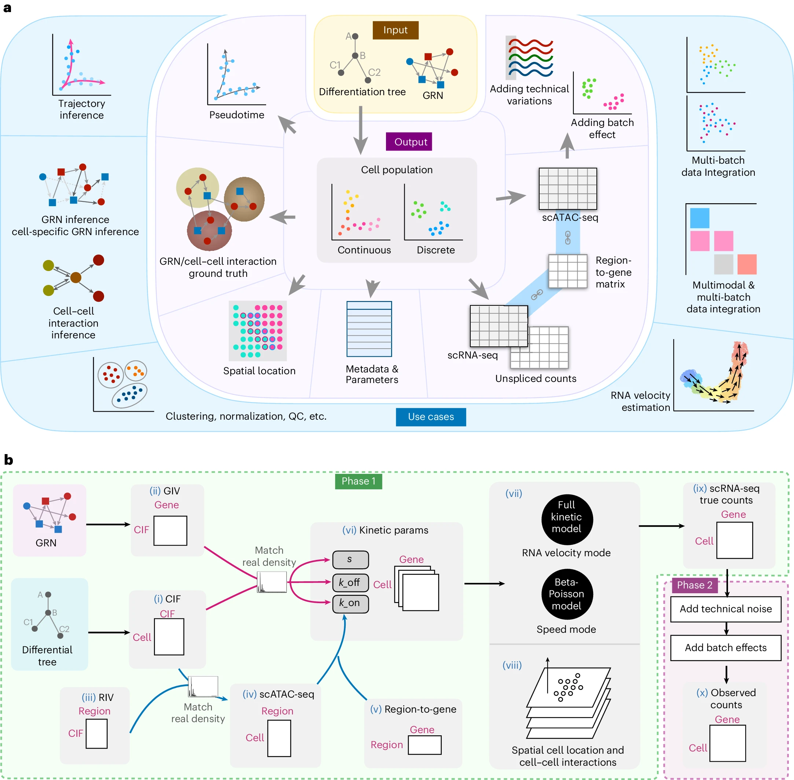

    
    

        Figure 1: Workflow
          
    

 

## Author

[**Xiuwei Zhang** (张秀苇)](https://xiuweizhang.wordpress.com/)

Assistant Professor, Georgia Institute of Technology

代表工作（来自课题组工作网站）：

- *Single cell multi-modal, multi-batch, multi-condition data integration and analysis*. (Example projects: scDART, scMoMaT,scDisInFact)
- *Temporal analysis of single cells: how cells change over pseudotime or real time through cell divisions*. (Example projects: CellPath, LinRace)
- *Spatial-omics* *and Spatial-temporal dynamics of cells* (Example projects: scHybridNMF, CLARIFY, TemSOMap, SpaDecoder)
- *Simulation of single cell omics (including temporal and spatial) data to evaluation computational methods*. (Example projects: TedSim, [scMultiSim](https://github.com/ZhangLabGT/scMultiSim))
- *Inference of gene regulatory networks, cell-cell interactions, and cross-modality relationships in multi-omics data*. (Example projects: CespGRN, CLARIFY)

## Simulation of single cell omics

**To** evaluate the performance of proposed computational methods

**By** generating data that models biological mechanisms and provides ground truth for benchmarking

一句话概括：实验数据缺失或不足的情况下，模拟数据→评估计算方法

|   Tools   |  id  | GRNs | velocity | CCI  | reference-based | multiomic |
| :-------: | :--: | :--: | :------: | :--: | :-------------: | :-------: |
|  SymSim   |  ✔️   |      |          |      |                 |           |
|  SERGIO   |      |  ✔️   |    ✔️     |      |                 |    ✔️❌     |
|  BEELINE  |      |  ✔️   |          |      |                 |           |
|  dyngen   |      |  ✔️   |    ✔️     |      |                 |    ✔️❌     |
|  VeloSim  |      |      |    ✔️     |      |                 |           |
|  mistyR   |      |      |          |  ✔️   |                 |           |
| scDesign3 |      |      |          |      |        ✔️        |     ✔️     |

CCI: cell–cell interaction

## Methods

### 模型介绍

| Input |                            Output                            |
| :---: | :----------------------------------------------------------: |
|       | cell identity,RNA velocity, GRNs, CCI, relationships between chromatin accessibility and transcriptome data |

①能够解决的问题：

测评 clustering, trajectory inference, RNA velocity estimation, **multimodal and multi-batch data integration**, **GRN inference** and **CCI inference**

***mosaic integration***，特指 multimodal and multi-batch data integration

②主要创新点：

- using multi-omics data without using only scRNA-seq data

- allows users to adjust the effect of each **biological factor** on the output data→investigate how the methods’ performance is affected by each factor

### 原理

Single cell multi-modal, multi-batch, multi-condition data integration and analysis. (Example projects: scDART, scMoMaT,scDisInFact)

Temporal analysis of single cells: how cells change over pseudotime or real time through cell divisions. (Example projects: CellPath, LinRace)

Spatial-omics and Spatial-temporal dynamics of cells (Example projects: scHybridNMF, CLARIFY, TemSOMap, SpaDecoder)

Simulation of single cell omics (including temporal and spatial) data to evaluation computational methods. (Example projects: TedSim, scMultiSim)

Inference of gene regulatory networks, cell-cell interactions, and cross-modality relationships in multi-omics data. (Example projects: CespGRN, CLARIFY)